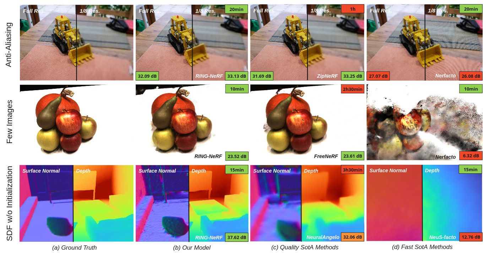

<h1>RING-NeRF: Rethinking Inductive Biases for Versatile and Efficient Neural Fields</h1>

    <a href='https://doriandpetit.com/' target='_blank'>Doriand Petit</a>1,2&emsp;
    <a href='https://scholar.google.com/citations?hl=fr&user=Ym-suFYAAAAJ' target='_blank'>Steve Bourgeois</a>1&emsp;
    <a href='https://cedric.cnam.fr/lab/en/author/paveld/' target='_blank'>Dumitru Pavel</a>1&emsp;
    <a href='https://scholar.google.com/citations?user=kUVG8pIAAAAJ&hl=fr' target='_blank'>Vincent Gay-Bellile</a>1&emsp;
    <a href='https://scholar.google.fr/citations?hl=fr&user=be4jSOIAAAAJ' target='_blank'>Florian Chabot</a>1&emsp;
    <a href='https://www.irit.fr/~Loic.Barthe/' target='_blank'>Loïc Barthe</a>2&emsp;

    1Université Paris-Saclay, CEA, List, F-91120, Palaiseau, France&emsp; 
    2IRIT, Université Toulouse III, CNRS, France&emsp; 

    <strong>🎉 RING-NeRF has been accepted to ECCV'24 ! See you @ Milan ! 🎉</strong>

    <h4 align="center">
        • <a href="https://cea-list.github.io/RING-NeRF/" target='_blank'>[Project Page]</a> • <a href="https://arxiv.org/abs/2312.03357" target='_blank'>[arXiv]</a> •
    </h4>

***
**This is the official repository of  RING-NeRF: Rethinking Inductive Biases for Versatile and Efficient Neural Fields and contains the source code of the associated project page. The publication's source code will soon be released in this repository.**

## Abstract
> Recent advances in Neural Fields mostly rely on developing task-specific supervision which often complicates the models. Rather than developing hard-to-combine and specific modules, another approach generally overlooked is to directly inject generic priors on the scene representation (also called inductive biases) into the NeRF architecture. Based on this idea, we propose the RING-NeRF architecture which in cludes two inductive biases : a continuous multi-scale representation of the scene and an invariance of the decoder’s latent space over spatial and scale domains. We also design a single reconstruction process that takes advantage of those inductive biases and experimentally demonstrates on par performances in terms of quality with dedicated architecture on multiple tasks (anti-aliasing, few view reconstruction, SDF reconstruction without scene-specific initialization) while being more efficient. Moreover, RING-NeRF has the distinctive ability to dynamically increase the resolution of the model, opening the way to adaptive reconstruction.

